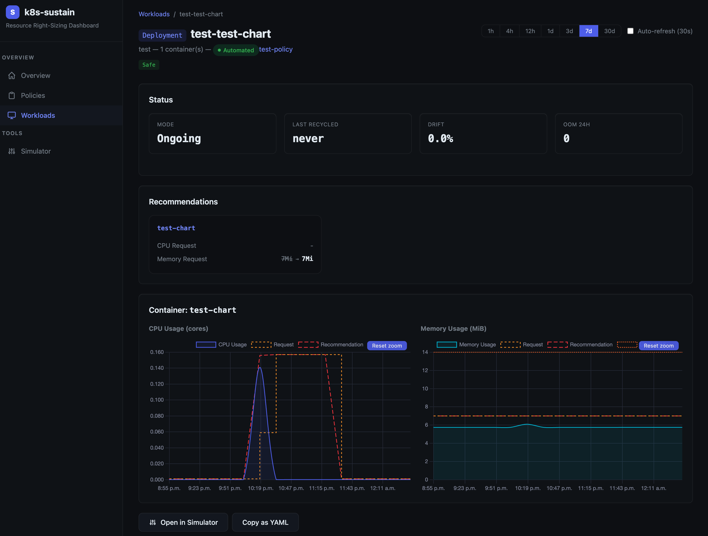

## :warning: Warning :warning:

**It's still in development, please don't install / test it until first release, thanks !**

# k8s-sustain

Kubernetes operator that automatically right-sizes workload resource requests and limits using historical Prometheus metrics — no manual tuning, no wasted cloud spend.

Over-provisioned clusters are one of the largest hidden sources of cloud waste: unused CPU and memory still consume energy, generate heat, and drive demand for more hardware. k8s-sustain exists because **resource optimization should be accessible to everyone** — from a single-node homelab to a thousand-node production fleet. Every cluster that right-sizes its workloads is a small step toward reducing the environmental footprint of cloud infrastructure.

**[Documentation](https://noony.github.io/k8s-sustain)**

## How it works

k8s-sustain watches `Policy` objects and applies percentile-based resource recommendations to opted-in workloads. Two independent components handle updates:

- **Controller** — periodically reconciles Policy objects and recycles stale pods; uses in-place pod updates on k8s ≥ 1.31, PDB-respecting eviction otherwise
- **Admission webhook** — injects resources at pod creation time, before scheduling

Workloads opt in with a single annotation:

```yaml
metadata:
  annotations:
    k8s.sustain.io/policy: my-policy
```

## Dashboard



## Documentation

- [Getting Started](https://noony.github.io/k8s-sustain/getting-started/installation/)
- [Architecture](https://noony.github.io/k8s-sustain/concepts/architecture/)
- [Update Modes](https://noony.github.io/k8s-sustain/concepts/update-modes/)
- [Policy CRD Reference](https://noony.github.io/k8s-sustain/reference/policy/)
- [Helm Values](https://noony.github.io/k8s-sustain/reference/helm-values/)

## License

ISC License
