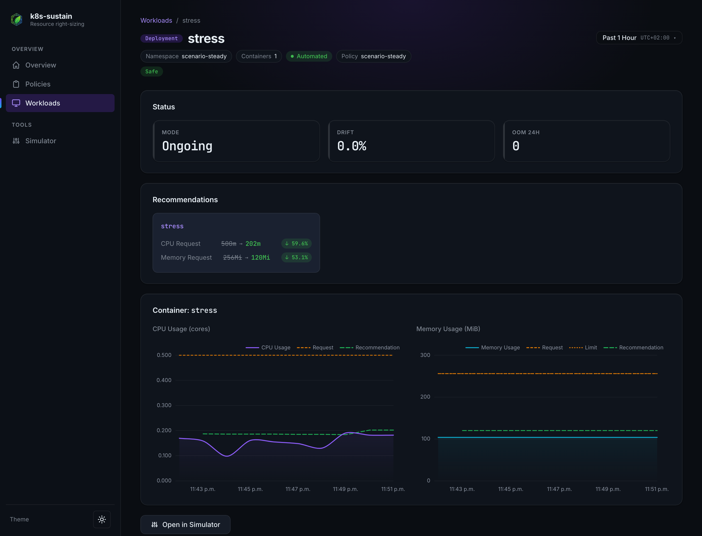

# k8s-sustain

Kubernetes operator that automatically right-sizes workload resource requests and limits using historical Prometheus metrics — no manual tuning, no wasted cloud spend.

Over-provisioned clusters are one of the largest hidden sources of cloud waste: unused CPU and memory still consume energy, generate heat, and drive demand for more hardware. k8s-sustain exists because **resource optimization should be accessible to everyone** — from a single-node homelab to a thousand-node production fleet. Every cluster that right-sizes its workloads is a small step toward reducing the environmental footprint of cloud infrastructure.

**[Documentation](https://noony.github.io/k8s-sustain)**

## How it works

k8s-sustain watches `Policy` objects and applies percentile-based resource recommendations to opted-in workloads. Two independent components handle updates:

- **Controller** — periodically reconciles Policy objects and recycles stale pods; uses in-place pod updates on k8s ≥ 1.33, PDB-respecting eviction otherwise. CronJob, Job and bare-pod workloads are never evicted — their running pods are only resized in place, because eviction would discard in-flight work and nothing would recreate a bare pod
- **Admission webhook** — injects resources at pod creation time, before scheduling

Workloads opt in with a single annotation:

```yaml
metadata:
  annotations:
    k8s.sustain.io/policy: my-policy
```

## Dashboard



## Documentation

- [Getting Started](https://noony.github.io/k8s-sustain/getting-started/installation/)
- [Architecture](https://noony.github.io/k8s-sustain/concepts/architecture/)
- [Update Modes](https://noony.github.io/k8s-sustain/concepts/update-modes/)
- [Policy CRD Reference](https://noony.github.io/k8s-sustain/reference/policy/)
- [Helm Values](https://noony.github.io/k8s-sustain/reference/helm-values/)

## Security & supply chain

Release artifacts are signed with [cosign](https://docs.sigstore.dev/) in keyless mode — no private key, with the signing event recorded in the public Rekor transparency log:

- **Container images** (`ghcr.io/noony/k8s-sustain`, amd64 + arm64) — cosign signature, SLSA build provenance and an SPDX SBOM, all attached in the registry
- **Release binaries** — a cosign-signed `sha256sums.txt`, an SPDX SBOM, and per-binary build provenance
- **Helm charts** (`oci://ghcr.io/noony/helm-charts`) — cosign-signed by digest

Verify an image before you deploy it:

```bash
cosign verify \
  --certificate-identity-regexp '^https://github\.com/noony/k8s-sustain/\.github/workflows/release\.yml@refs/tags/v' \
  --certificate-oidc-issuer https://token.actions.githubusercontent.com \
  ghcr.io/noony/k8s-sustain:<version>
```

Full verification instructions — provenance, SBOM, binaries, charts, and enforcing signatures at admission — are in the [Security documentation](https://noony.github.io/k8s-sustain/security/).

To report a vulnerability, open a [private security advisory](https://github.com/noony/k8s-sustain/security/advisories/new) rather than a public issue.

## License

ISC License
