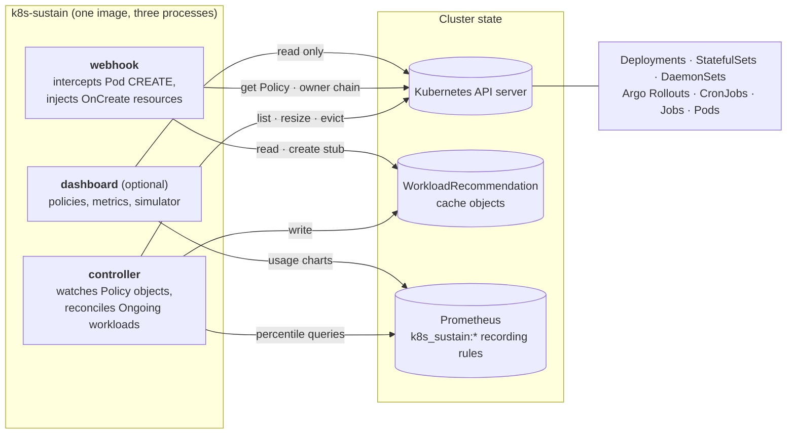

# Architecture

k8s-sustain is split into three independent components that run as separate processes (different container args in the same image):

## Controller (`k8s-sustain start`)

The controller is a standard [controller-runtime](https://github.com/kubernetes-sigs/controller-runtime) reconciler that watches `Policy` objects.

**Reconcile loop:** a `Policy` event (create / update / periodic requeue) takes an **inventory** of the identities the policy can govern, then runs three phases in order — **discovery**, **computation**, **application**. Only computation talks to Prometheus. Independent `Policy` objects reconcile in parallel, bounded by `--policy-concurrency-limit` (default 10) — a separate knob from the per-workload fan-out inside the computation phase.

The controller requeues after `--reconcile-interval` (default `5m`).

### Inventory

`internal/inventory` turns workload objects into **identities** — one namespace, kind and name, possibly spanning several objects under [owner-name grouping](../guides/standalone-pods-and-grouping.md) — and is the only place that does. The dashboard reads identities from it too, so both apply the same rules:

- **Members** are the live objects of an identity. A finished standalone Job and a CronJob's Jobs are never members; a bare pod is one when it has no controller owner and a valid `k8s.sustain.io/owner-name`
- Each member is **governed** by the Policy it opts into (see [resolution order](../reference/annotation.md#resolution-order)) when that Policy exists, manages its kind and its selector matches it
- An identity is governed by its members' Policy when they agree, and is **Conflicted** when they name different Policies — then no Policy governs it (see [Conflicted identities](workload-recommendations.md#conflicted-identities))
- An identity with no member left but a `WorkloadRecommendation` is **Departed**; its Policy is the one its `WorkloadRecommendation` names, while that Policy still covers its namespace and kind
- Its containers are the union of its governed members' containers (the newest member's declaration wins for a name several declare), and its age runs from its earliest member or from its `WorkloadRecommendation`'s creation, whichever is older

A reconcile reads only the namespaces in `selector.namespaces` (all when empty) and the kinds the policy manages. Every member of an identity shares its namespace and kind, so the narrowed read still sees whole identities. Reads go through the controller's informer cache.

### Discovery

For every live identity the policy governs, ensure a `WorkloadRecommendation` exists, creating it when missing and keeping its policy label and `status.observedResources` snapshot current. Only the governing Policy writes it, so two Policies never rewrite the same object back and forth.

Discovery issues **no Prometheus queries**, so expect one `WorkloadRecommendation` per governed identity from the first reconcile onward, most of them briefly empty.

### Computation

The work-list is **every identity the policy governs**, Departed ones included, so an identity with no live member — a completed Job, a bare-pod group between runs — is still recomputed on every cycle. A Conflicted identity is not on it.

- Set aside workloads in retry backoff from a previous transient failure. The decision is taken once, before the fetch, and holds until the application phase; an identity whose every workload is set aside is not fetched
- Fetch every other identity's Prometheus inputs in **one batched call per policy** (see [Recommendation Pipeline](recommendation-pipeline.md#how-the-data-is-fetched)) — a handful of queries for the whole policy instead of several per workload. Every kind batches identically, including `Job` and `Pod`
- Compute the fetched identities in parallel (bounded by `--workload-concurrency-limit`, default 5): detect autoscalers (HPA / KEDA `ScaledObject`) targeting the workload — read-only, no patches — and compute a per-container recommendation with its [trace](recommendation-pipeline.md#trace) (see [Recommendation Pipeline](recommendation-pipeline.md))
- Each identity leaves this pass with one outcome: a recommendation, too young, no data, fetch failed, or not fetched
- The unit is the **identity**, not the workload object: a group of workloads sharing an owner-name produces one computation and one write, against the union of the members' containers
- Write the result back to the `WorkloadRecommendation`, regardless of update mode and before any pod is touched — this keeps `OnCreate` workloads visible on the dashboard and is the webhook's only source of recommendations at admission (it never queries Prometheus itself)
- Record the outcome in `status.outcome` (`Computed`, `NoData`, `TooYoung`, `FetchFailed`). An outcome other than `Computed` keeps the last Recommendation — a last-known-good is never overwritten. The identity is recomputed on the next cycle and converges as soon as Prometheus has enough history
- A **departed** identity stops here. It is computed and cached so the webhook can inject it into that identity's *next* pod, but there are no running pods to align

Departed refreshes are counted in `k8s_sustain_wlr_refresh_total{namespace, owner_kind, outcome}`; see [Metrics](../reference/metrics.md#k8s_sustain_wlr_refresh_total).

A Conflicted identity is only recorded: `status.outcome: Conflicted` on its `WorkloadRecommendation`, whose `spec.policy` and Recommendation stay as the last governing Policy left them.

### Application

Only the governed members of live identities in `Ongoing` mode are applied. `OnCreate`-mode workloads stop after computation — the recommendation is cached but never applied by the controller, because resource injection at pod creation is the webhook's job — and a departed identity has no pods to apply anything to, so it stopped in the previous phase.

- If recommend-only is in effect, log the recommendation and skip patching — see [Recommend-only mode](update-modes.md#recommend-only-mode)
- Recycle stale running pods: in place through the `pods/resize` subresource on k8s ≥ 1.33, PDB-respecting eviction otherwise, with the webhook injecting the latest resources into replacement pods. Only pods owned by the member are touched — see [Eviction safeguards](update-modes.md#eviction-safeguards)
- CronJob, Job and bare-pod pods are resized in place only, never evicted — see [Kinds that are never evicted](in-place-updates.md#kinds-that-are-never-evicted)
- Under owner-name grouping, every member is applied independently against the identity's one shared recommendation, narrowed to the containers that member actually declares
- Emit a `ResourcesUpdated` event on the workload object **only when at least one pod was actually resized in place or evicted** in that reconcile. The workload's pod template is never patched, so it permanently differs from the recommendation — a reconcile that finds every pod already at target stays silent. The message names the pod count and the containers (e.g. `Updated resources on 2 pod(s) for containers: [app]`); the applied values are on each pod's own `ResizeStarted` event. The events API groups events by object and reason, so updates of the same workload less than ~6 minutes apart are folded into one Event whose `series.count` and `lastObservedTime` advance
- On transient failure (Prometheus timeout, API 5xx), schedule retry with exponential backoff (30s base, 5min cap) and emit a `ReconciliationRetryScheduled` warning event on the workload

Up to `--policy-concurrency-limit` policies (10 by default) fetch at once, each running up to 8 shard queries concurrently, more while a failed shard is re-queried one identity at a time — enough to burst well past Prometheus's own `--query.max-concurrency` (default 20, shared with every other consumer of that server: Grafana dashboards, alerting rules). `--prometheus-max-inflight` (default 8) is a separate, global cap on concurrent Prometheus queries across the whole controller process — it throttles the client itself rather than the fan-out, so it protects Prometheus even if the concurrency limits are turned up.

### Pod OOM watcher

A second controller-runtime reconciler runs alongside the Policy reconciler and watches `Pod` objects cluster-wide, filtered by a local event predicate to those carrying the `k8s.sustain.io/policy` annotation OR a fresh `OOMKilled` container status. It exists to close the multi-minute latency window between an OOM kill and the next recording-rule-driven reconcile (kube-state-metrics scrape → Prometheus scrape → 1m rule evaluation → 5–10m reconcile interval).

When a container's `LastTerminationState.Terminated.Reason == "OOMKilled"` is observed for a kill not already handled, the watcher resolves the pod's policy the same way every other reader does and, if the pod is managed by some policy:

- Resolves the pod's top-level workload owner and records the kill in an in-memory cache keyed by `(namespace, ownerKind, ownerName, container)`, deduplicated by restart count and termination time
- Records the memory limit the kubelet had actually applied to the container (`ContainerStatus.Resources`, falling back to the pod spec), so the recommender has a bump anchor before Prometheus surfaces the OOM-time limit
- Enqueues the owning Policy for immediate reconcile via a `source.Channel` wired into the Policy reconciler's work queue.

The recommender reads the cache during recommendation build: a hit sets the live OOM signal for that container only — equivalent to the per-container Prometheus `workload_oom_24h` recency signal — and feeds the OOM-floor stage of the [Recommendation Pipeline](recommendation-pipeline.md#stages). The math and bump factor are unchanged — the watcher only makes the trigger and the signal source fresher.

**Operational notes.** The cache is in-memory and lives only for the lifetime of the controller process; on restart, the 24h Prometheus history (`k8s_sustain:workload_oom_24h`, `k8s_sustain:container_oom_limit_24h:bytes`) repopulates the floor on the next reconcile. The watcher is leader-elected like other controllers — non-leaders idle.

## Admission Webhook (`k8s-sustain webhook`)

The webhook is a [mutating admission webhook](https://kubernetes.io/docs/reference/access-authn-authz/admission-controllers/#mutatingadmissionwebhook) that intercepts `pods/CREATE` requests.

**Admission flow:**

1. Pod creation request arrives at the API server
2. API server calls `POST /mutate` on the webhook service
3. Webhook resolves the pod's policy — see [resolution order](../reference/annotation.md#resolution-order)
4. Fetches the named Policy and checks the pod matches its selector
5. Resolves the pod's owner chain to determine the workload kind:
   - `Pod → ReplicaSet → Deployment` or `Argo Rollout`
   - `Pod → Job → CronJob`, or `Pod → Job` for a standalone Job
   - `Pod → StatefulSet / DaemonSet`
   - a `k8s.sustain.io/owner-name` annotation replaces the resolved name; on a pod with no controller owner it makes the pod a `Pod`-kind identity (see [Standalone Pods & Identity Grouping](../guides/standalone-pods-and-grouping.md))
6. Checks that the policy manages that workload kind at all. Both `OnCreate` **and** `Ongoing` inject — otherwise an `Ongoing` pod would start on template resources and wait for a resize it does not need
7. Reads the `WorkloadRecommendation` the controller already cached for that workload (`fetchRecommendations` in `internal/webhook/recommendations.go`) — the webhook itself never queries Prometheus — and uses it only when its `spec.policy` is the Policy the pod opts into
8. Narrows the cached recommendation to the containers present in this pod, matched by name. A container that already has resources set is *not* skipped — the patch replaces whatever the template specified
9. If the cache is stale beyond `DefaultCacheStaleness` (30 min), or `--recommend-only` is set, allows the pod through with its template resources unchanged. If the cache is **missing entirely**, additionally creates a stub `WorkloadRecommendation` so the controller computes one for the next pod of this workload
10. Otherwise returns an RFC 6902 JSON Patch with the recommended resources
11. The API server applies the patch before persisting the pod

The webhook **fails open** (`failurePolicy: Ignore` by default) — if it is unreachable or returns an error, the pod is admitted unchanged. See [Admission behaviour](workload-recommendations.md#admission-behaviour) for each outcome.

**Latency budget.** The handler is bounded by a hard 4s deadline on the admission context (under the apiserver's 5s `MutatingWebhookConfiguration` timeout). The only outbound work in the admission path is a handful of Kubernetes API reads (Policy lookup, owner resolution, the `WorkloadRecommendation` read), each bounded by a 2s per-call timeout. `Policy`, `WorkloadRecommendation` and `Namespace` reads are served from an informer cache.

**Stub writes (the webhook's only write).** The webhook computes nothing, so it never writes a recommendation. It does write one thing: when a pod is admitted for a workload identity that has no `WorkloadRecommendation` at all, it creates an empty-status **stub** — recording the admitted pod's container set in `status.observedResources` — and admits the pod unchanged. Creating the object is what puts the identity into the controller's work-list; the [computation phase](#computation) fills in the recommendation on its next cycle, so the next pod of that workload is injected.

This is how identities no reconcile ever sees alive — bare pods and standalone Jobs created and deleted between two reconciles — get discovered. See [Cold start](workload-recommendations.md#cold-start-stub-recommendations) for the full lifecycle.

## Dashboard (`k8s-sustain dashboard`)

The dashboard is an optional web UI that provides:

- **Policy overview** — list all policies with status, namespaces, workload types
- **Workload metrics** — interactive CPU and memory time-series charts
- **Policy simulator** — test "what-if" scenarios with different percentiles, headroom, and min/max values, computed by the same `internal/recommender` pipeline the controller applies

It is read-only: it queries the Kubernetes API and Prometheus but never modifies any resources. See the [Dashboard guide](../guides/dashboard.md) for details.

## Recommend-only mode

See [Recommend-only mode](update-modes.md#recommend-only-mode).

## Recommendation pipeline

See [Recommendation Pipeline](recommendation-pipeline.md) for how recommendations are computed.

## Prometheus recording rules

k8s-sustain ships recording rules that the controller and dashboard query. See [Recording Rules](../reference/recording-rules.md) for the full catalogue.

## Policy selection

Each workload explicitly opts into one policy through the `k8s.sustain.io/policy` annotation; the controller, webhook and dashboard resolve it through the same function. See [resolution order](../reference/annotation.md#resolution-order).
