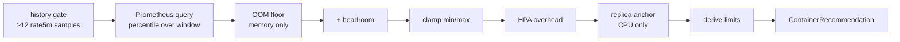

# Recommendation Pipeline

This page describes how k8s-sustain produces a per-container recommendation, from raw Prometheus metrics to the final request and limit values applied to a pod.

## Containers covered

Both regular containers and init containers are recommended by default.
Sidecar (restartable) and classic (one-shot) init containers are treated
uniformly: each gets a per-container recommendation derived from its own
Prometheus series. Set `spec.rightSizing.excludeInitContainers: true` on a
policy to skip init containers for the workloads it targets.

The controller recycles a running pod when a regular container or a
restartable sidecar drifts from the recommendation. Drift in classic init
containers does not trigger recycle — they have already exited; the new
requests apply on next pod creation via webhook injection.

## Stages

The recommender runs each container through the following stages, in order:

1. **History gate.** Probe `count_over_time(k8s_sustain:container_cpu_usage_by_workload:rate5m[window:1m])`. If fewer than 12 samples are available, the workload is skipped with `k8s_sustain_recommendation_skipped_total{reason="insufficient_history"}`. This avoids producing a near-zero percentile that would floor to the hard minimum and trigger a recycle on the next reconcile.
2. **Query.** Read the percentile-of-usage from a recording rule over the configured window (`spec.rightSizing.resourcesConfigs.<cpu|memory>.window`). The signal is workload-level (sum across replicas) divided by the median replica count over the window, with a per-pod percentile floor to absorb load imbalance.
3. **OOM floor (memory only).** When the workload OOM'd in the last 24 h (`k8s_sustain:workload_oom_24h > 0`), the memory recommendation is floored at `max(peak_working_set_24h, current_request)` before headroom. This prevents the recommendation from shrinking memory while the workload is unhealthy. The metric `k8s_sustain_oom_floor_applied_total{container}` increments when this floor wins.
4. **Headroom.** Multiply by `(1 + headroom/100)` to add a safety buffer.
5. **Clamp.** Floor to `minAllowed`, cap at `maxAllowed` (when set). `maxAllowed` always wins, including over the OOM floor.
6. **HPA overhead.** When `autoscalerCoordination.enabled` and the workload is targeted by an HPA or KEDA `ScaledObject` on `averageUtilization`, multiply by `(100 / hpa_target_pct) × 1.10`. The clamps from step 5 are re-applied so explicit policy caps survive coordination.
7. **Replica-budget correction (CPU only).** When `autoscalerCoordination.replicaBudgetAnchor` is set, multiply CPU request by `clamp(current_replicas / target_replicas, 0.5, 2.0)`, where `target_replicas = round(min + anchor × (max - min))`.
8. **Limits derivation.** Apply the `limits` strategy (`keepLimit` / `keepLimitRequestRatio` / `equalsToRequest` / `noLimit` / `requestsLimitsRatio`).

## Diagram



## Worked example

Configuration:

```yaml
apiVersion: k8s.sustain.io/v1alpha1
kind: Policy
metadata:
  name: example
spec:
  rightSizing:
    autoscalerCoordination:
      enabled: true
    resourcesConfigs:
      cpu:
        window: 168h
        requests:
          percentile: 95
          headroom: 10
          minAllowed: 50m
          maxAllowed: 4000m
        limits:
          keepLimitRequestRatio: true
```

Per-pod CPU p95 over 168h: `100m`. Headroom 10% → `110m`. Within clamp `[50m, 4000m]` → `110m`. HPA targets CPU at 70% utilization → overhead factor `(100 / 70) × 1.10 ≈ 1.57` → `173m`. No `replicaBudgetAnchor` → unchanged. Existing limit was 2× request → new limit `346m`.

## Where each knob lives

- Percentile, headroom, clamps: [`spec.rightSizing.resourcesConfigs`](../reference/policy.md#cpurequests-memoryrequests).
- HPA overhead and replica anchor: [`spec.rightSizing.autoscalerCoordination`](../reference/policy.md#specrightsizingautoscalercoordination). Detection rules and rationale in [Autoscaler Coordination](autoscaler-coordination.md).
- Limits derivation: [`spec.rightSizing.resourcesConfigs.<cpu|memory>.limits`](../reference/policy.md#cpulimits-memorylimits).
- Recording rules backing the percentile query: [Recording Rules](../reference/recording-rules.md).
