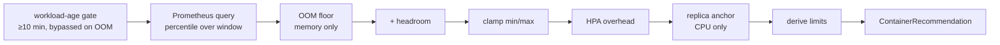

# Recommendation Pipeline

This page describes how k8s-sustain produces a per-container recommendation, from raw Prometheus metrics to the final request and limit values applied to a pod.

## Containers covered

Both regular containers and init containers are recommended by default.
Sidecar (restartable) and classic (one-shot) init containers are treated
uniformly: each gets a per-container recommendation derived from its own
Prometheus series. Set `spec.rightSizing.excludeInitContainers: true` on a
policy to skip init containers for the workloads it targets.

The controller recycles a running pod when a regular container or a
restartable sidecar drifts from the recommendation. Drift in classic init
containers does not trigger recycle — they have already exited; the new
requests apply on next pod creation via webhook injection.

## How the data is fetched

Before running the stages below, the controller fetches every identity's Prometheus inputs for a policy in **one sharded batch call per policy**, not one query set per workload. A policy matching 2,000 workloads issues a handful of queries rather than several thousand.

The work-list that batch is built from is the policy's `WorkloadRecommendation` objects, not its workload listing — see [Computation](architecture.md#computation). An identity that appears in no listing (a completed Job, a bare-pod group between runs) is therefore batched and recomputed like any other. The listing is not discarded, though: it still supplies an identity discovered moments earlier in the same reconcile but not yet visible to the `WorkloadRecommendation` list itself, so that identity is batched too — see [Computation](architecture.md#computation) for why.

Shards are sized by a projected sample budget — containers × window-minutes, summed across the workloads packed into a shard — capped by `--query-shard-max-samples` (default `10,000,000`). The cap exists because Prometheus's own `--query.max-samples` (default `50,000,000`) *rejects* an over-budget query outright, which would fail every workload sharing that shard rather than just the excess ones; the default leaves a 5× margin. Independently, `--prometheus-max-inflight` (default 8) caps concurrent queries across the whole controller process so k8s-sustain cannot saturate a Prometheus shared with dashboards and alerting.

Every kind batches identically, including `Job` and `Pod`. `Job` and `Pod` used to be excluded and fell back to a per-workload fetch, because those two ephemeral kinds needed an extra "oldest sample" value for the workload-age gate below, and that value came from a mandatory PromQL subquery that could not be sharded the way the CPU/memory/OOM queries are. The gate now reads the identity's `WorkloadRecommendation` creation timestamp instead, so that query — and the exclusion it justified — is gone. An identity can still take an individual per-workload fetch outside the batch when it has no observed-resources snapshot to size a shard with. That is now confined to identities with no live workload object behind them: a live identity's snapshot is built from its members' own pod templates in the same cycle, so it never has to wait for a write to land first. A departed identity that was never snapshotted at all (a webhook stub whose status write failed) is skipped rather than fetched, since there is no container set to compute against either.

Coverage and health are observed separately and must not be derived from one another — see [Batch prefetch coverage vs. failures](../reference/metrics.md#batch-prefetch-coverage-vs-failures).

## Stages

The recommender runs each container through the following stages, in order:

1. **Workload-age gate.** If the workload is younger than 10 minutes, it is skipped (controller emits `k8s_sustain_recommendation_skipped_total{reason="workload_too_young"}`). This avoids producing a near-zero percentile that would floor to the hard minimum and trigger a recycle on the next reconcile. The gate is workload-age based rather than sample-count based so it doesn't punish workloads with intrinsically sparse signal (e.g. a daily CronJob). The age is the *earliest known* of two signals: the workload object's `CreationTimestamp`, and the identity's `WorkloadRecommendation` `CreationTimestamp` — when k8s-sustain first recorded the identity. The second signal is what carries the ephemeral identity kinds, **Job** and **Pod** (bare pods opted in via `k8s.sustain.io/owner-name`). A standalone Job is re-created on every run, so its object is always seconds old even though the identity has been known for days; a bare pod has no workload object at all, so its object age is unknown (zero) and the identity's first-seen time is the only signal there is. The gate compares elapsed time against 10 minutes, so "how long has this identity been known" answers exactly the question it asks — it is not a sample count. Usually the two signals diverge because an identity predates its `WorkloadRecommendation` (fresh install, a new Policy, or a cache object recreated after retention lapsed); in all of those the cache object is the *younger* one, so the gate errs toward waiting one more reconcile rather than recommending from unstable near-zero samples. One divergence runs the other way: losing the Prometheus data itself (retention loss, a reinstall) resets first observation to now while the cache object keeps its old age, so the gate can pass an identity whose samples are only minutes old. That window is narrow — a total absence of data yields no recommendation at all, so only the partial refill is exposed — but it is a real gap, and it is the price of a gate that no longer depends on Prometheus to know how old something is. When neither signal exists the gate disables itself, since there would be nothing to recommend from anyway. `Pod`-kind targets (bare pods) are gated exactly like every other kind — they used to be exempt, back when a bare pod could never be recycled at all and a near-zero percentile had nothing to act on, but that stopped being true once `Ongoing` bare pods started being resized in place; a brand-new bare-pod identity with partial warm-up samples can now produce a near-zero percentile that floors to the hard minimum and gets applied in place, which for memory can kill the container. In practice the exposure of the gate applying late to a bare pod is narrow — it keys on the *earliest* of the two signals, so a recurring bare-pod identity clears it on its long-lived cache object regardless, and a brand-new one usually has no samples to recommend from in the first place. EXCEPTION: a recent OOM in ANY container of the workload (`sum(k8s_sustain:workload_oom_24h) > 0` or a fresh kill from the in-memory watcher) bypasses the gate so a crash-looping container can still get a memory recommendation anchored on the OOM peak — a workload that OOMed anywhere is not "too young to have data". This entire pipeline, including this gate, runs only on the controller, on its periodic reconcile — once per [`WorkloadRecommendation`](workload-recommendations.md) the policy owns, which covers identities the periodic listing never catches alive as well as live ones. One shared code path computes all of them, so a workload's numbers never depend on which component first created its cache object. The webhook queries Prometheus not at all and computes nothing: at admission it only reads whatever the controller last cached in the `WorkloadRecommendation` (see [Workload Recommendations](workload-recommendations.md)). Without the gate, the controller's first computed recommendation for a brand-new workload would be the hard-floored minimums (1m CPU / 1Mi memory), and the webhook would inject exactly that and almost certainly crashloop the pod.
2. **Query.** Read the percentile-of-usage from a recording rule over the configured window (`spec.rightSizing.resourcesConfigs.<cpu|memory>.window`). The signal is a genuine per-pod percentile: `quantile_over_time(p, …[window])` over the `k8s_sustain:workload_max_pod_<cpu|memory>` recording rule, which at each instant is the **busiest replica** (`max by` across pods, per container). The query reads that rule as a plain range vector, not a `[window:1m]` subquery — the `k8s_sustain.workload_signal` rule group already evaluates at `interval: 1m`, so the range vector's resolution matches the rule's own resolution exactly, with no resampling step in between; raising that interval to cut Prometheus load would coarsen every recommendation percentile. Collapsing across pods in the recording rule (rather than at query time) keeps this scan cheap — one series per workload×container — and immune to pod-name churn, since dead pods drop out of the `max`. Because the percentile already covers the hottest replica, there is **no replica division and no separate per-pod floor**.
3. **OOM floor (memory only, per container).** When THIS container OOM'd in the last 24 h (`k8s_sustain:workload_oom_24h` keeps the `container` label, so the recency check is per-container), its memory recommendation is floored at `max(peak_working_set_24h, oom_time_limit × 1.20)` before headroom. The floor never applies to innocent siblings: if container A OOMs, a sidecar B in the same pod keeps its pure percentile recommendation — even though the (non-OOM-scoped) peak rule reports a 24h high-water mark for B — and B gets no memory recommendation via the OOM bypass if it has no usage data. Two anchors are combined so the floor degrades gracefully: the peak working-set is precise when cAdvisor observes it, while the OOM-time limit bump is the safety net when peak is unreliable (cgroup v2 / sub-scrape OOM kills can hide the real high-water). The bump factor (`1.20`, matching VPA's `MemoryBumpUpRatio`) lifts the recommendation above the limit the kernel killed at, breaking the OOM loop. The OOM-time-limit anchor only refreshes when a NEW OOM event fires, so once the workload fits after a bump, the recorded limit stays at its pre-bump value and stops growing. The metric `k8s_sustain_oom_floor_applied_total{container}` increments when this floor wins.

    The floor also fires when the in-memory [Pod OOM watcher](architecture.md#pod-oom-watcher) reports a fresh kill, even if the Prometheus recording rule has not yet surfaced it. The live signal is per-container too — a live OOM for container X floors X only — and is treated equivalently to the Prometheus recency signal; the per-container memory limit captured from the pod spec at the moment of OOM is used as the bump anchor until Prometheus catches up.
4. **Headroom.** Multiply by `(1 + headroom/100)` to add a safety buffer.
5. **Clamp.** Floor to `minAllowed`, cap at `maxAllowed` (when set). `maxAllowed` always wins, including over the OOM floor.
6. **HPA overhead.** When `autoscalerCoordination.enabled` and the workload is targeted by an HPA or KEDA `ScaledObject` on `averageUtilization`, multiply by `(100 / hpa_target_pct) × 1.10`. The clamps from step 5 are re-applied so explicit policy caps survive coordination.
7. **Replica-budget correction (CPU only).** When `autoscalerCoordination.replicaBudgetAnchor` is set, multiply CPU request by `clamp(current_replicas / target_replicas, 0.5, 2.0)`, where `target_replicas = round(min + anchor × (max - min))` — see [Autoscaler Coordination](autoscaler-coordination.md) for how this interacts with the webhook now that it only serves the controller's cached value.
8. **Limits derivation.** Apply the `limits` strategy (`keepLimit` / `keepLimitRequestRatio` / `equalsToRequest` / `noLimit` / `requestsLimitsRatio`).

## Diagram


```mermaid
flowchart LR
    G[workload-age gate<br/>≥10 min, bypassed on OOM] --> Q[Prometheus query<br/>percentile over window]
    Q --> F[OOM floor<br/>memory only]
    F --> H[+ headroom]
    H --> C[clamp min/max]
    C --> O[HPA overhead]
    O --> R[replica anchor<br/>CPU only]
    R --> L[derive limits]
    L --> OUT[ContainerRecommendation]
```

## Worked example

Configuration:

```yaml
apiVersion: k8s.sustain.io/v1alpha1
kind: Policy
metadata:
  name: example
spec:
  rightSizing:
    autoscalerCoordination:
      enabled: true
    resourcesConfigs:
      cpu:
        window: 168h
        requests:
          percentile: 95
          headroom: 10
          minAllowed: 50m
          maxAllowed: 4000m
        limits:
          keepLimitRequestRatio: true
```

Per-pod CPU p95 over 168h: `100m`. Headroom 10% → `110m`. Within clamp `[50m, 4000m]` → `110m`. HPA targets CPU at 70% utilization → overhead factor `(100 / 70) × 1.10 ≈ 1.57` → `173m`. No `replicaBudgetAnchor` → unchanged. Existing limit was 2× request → new limit `346m`.

## Choosing a percentile

The percentile knob (`spec.rightSizing.resourcesConfigs.<cpu|memory>.requests.percentile`) maps directly to a `quantile_over_time(p, …)` against the recording rule. Pick by intent, not by gut feel:

| Percentile | Use when…                                                                                     | Risk                                                                       |
|------------|-----------------------------------------------------------------------------------------------|----------------------------------------------------------------------------|
| **p50**    | Cost-optimised batch workloads where short-lived saturation is acceptable.                    | Half of all samples exceed the request → frequent CPU throttling, OOMs.    |
| **p90**    | Stable services with a known traffic profile and a small tail.                                | The top 10% of samples sit above the request — fine if your SLO allows it. |
| **p95**    | Default for most online services. Trades the long tail for ~5% of moments above request.     | Tail-heavy workloads (cron-driven spikes) still get throttled at peak.     |
| **p99**    | Latency-sensitive services where throttling is a customer-visible regression.                 | Provisions for the rare bad minute — usually still 20–40% under p100.      |
| **p100**   | Memory on workloads that cannot tolerate even a single OOM (databases, queue brokers).        | Pays for the worst observed sample over the window — most expensive choice.|

Two practical patterns:

- **CPU p95 + Memory p100** — sane default for production services. CPU is throttle-able, so the tail is acceptable; memory isn't, so you pay for the peak.
- **Lower percentile + higher headroom** — `percentile: 90, headroom: 30` produces a smoother request than `percentile: 99, headroom: 0` even though both target the same effective request, because the headroom gives the kernel room to absorb spikes that no quantile sees. Prefer this when your usage pattern has rare large spikes that aren't representative of steady-state load.

Window length matters too: a 7-day window dampens daily peaks; a 24h window catches them. The OOM floor (step 3) protects you regardless of percentile when memory pressure becomes terminal.

## Where each knob lives

- Percentile, headroom, clamps: [`spec.rightSizing.resourcesConfigs`](../reference/policy.md#cpurequests-memoryrequests).
- HPA overhead and replica anchor: [`spec.rightSizing.autoscalerCoordination`](../reference/policy.md#specrightsizingautoscalercoordination). Detection rules and rationale in [Autoscaler Coordination](autoscaler-coordination.md).
- Limits derivation: [`spec.rightSizing.resourcesConfigs.<cpu|memory>.limits`](../reference/policy.md#cpulimits-memorylimits).
- Recording rules backing the percentile query: [Recording Rules](../reference/recording-rules.md).
