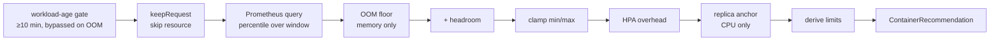

# Recommendation Pipeline

This page describes how k8s-sustain produces a per-container recommendation, from raw Prometheus metrics to the final request and limit values applied to a pod.

## Containers covered

Both regular containers and init containers are recommended by default.
Sidecar (restartable) and classic (one-shot) init containers are treated
uniformly: each gets a per-container recommendation derived from its own
Prometheus series. Set `spec.rightSizing.excludeInitContainers: true` on a
policy to skip init containers for the workloads it targets.

The controller recycles a running pod when a regular container or a
restartable sidecar drifts from the recommendation. Drift in classic init
containers does not trigger recycle — they have already exited; the new
requests apply on next pod creation via webhook injection.

## How the data is fetched

Before running the stages below, the controller fetches every identity's Prometheus inputs for a policy in **one batched call per policy**, not one query set per workload. A policy matching 2,000 workloads issues a handful of queries rather than several thousand.

The batch covers the policy's whole work-list, including identities with no live workload object — see [Computation](architecture.md#computation).

The batch is split into shards, each read with one query per signal (CPU, memory, OOM). Shards are sized by a projected sample budget — containers × window-minutes, summed across the workloads packed into a shard — capped by `--query-shard-max-samples` (default `10,000,000`). The cap exists because Prometheus's own `--query.max-samples` (default `50,000,000`) *rejects* an over-budget query outright, which would fail every workload sharing that shard rather than just the excess ones; the default leaves a 5× margin. Independently, `--prometheus-max-inflight` (default 8) caps concurrent queries across the whole controller process so k8s-sustain cannot saturate a Prometheus shared with dashboards and alerting.

A shard query that fails is retried once. If it fails again, its identities are re-queried one shard each, with the same query narrowed to one name, so a shard Prometheus rejects as a whole does not cost its healthy members their inputs — a single identity is just a batch of one ([ADR 0001](../adr/0001-single-identity-is-a-batch-of-one.md)). An identity whose CPU or memory query still fails on its own has failed its fetch: each of its workloads is retried with backoff (see [Application](architecture.md#application)). The OOM signal is best-effort: when it cannot be read, the identity is computed without an OOM floor.

Every kind batches identically, including `Job` and `Pod`. An identity whose container count is unknown (no observed-resources snapshot to size it by) gets a shard of its own; a departed identity with no snapshot at all is skipped, since there is no container set to compute against. An identity whose every workload is in retry backoff is not fetched.

The dashboard's simulations read their inputs the same way, one workload or a whole policy per call.

Coverage and health are observed separately and must not be derived from one another — see [Batch fetch coverage vs. failures](../reference/metrics.md#batch-fetch-coverage-vs-failures).

## Stages

The recommender runs each container through the following stages, in order:

1. **Workload-age gate.** An identity younger than 10 minutes is skipped (`k8s_sustain_recommendation_skipped_total{reason="workload_too_young"}`, log `skipping recommendation: workload too young`), so a near-zero early percentile is never floored to the hard minimum (1m CPU / 1Mi memory) and injected.
    - Age is the *earliest* of the identity's members' `creationTimestamp`s and its `WorkloadRecommendation`'s, which records when k8s-sustain first saw the identity. A new member of an owner-name group, or a new pod of a bare-pod group, does not reset it.
    - The `WorkloadRecommendation` is what lets ephemeral kinds pass: a standalone Job is re-created each run and a bare pod lives for one run, but their cache object persists across runs.
    - All kinds are gated, bare pods included. The controller and the dashboard's simulations date the identity the same way.
    - A recent OOM in any container of the workload (Prometheus 24h signal or the live [OOM watcher](architecture.md#pod-oom-watcher)) bypasses the gate so a crash-looping container still gets a memory recommendation.
    - Losing Prometheus data (retention loss, reinstall) while the cache object survives lets an identity pass on only minutes of samples.
2. **Keep request.** When `requests.keepRequest: true` is set for a resource, its request and limit are left unchanged and the remaining stages are skipped for that resource.
3. **Query.** Read the percentile-of-usage from a recording rule over the configured window (`spec.rightSizing.resourcesConfigs.<cpu|memory>.window`). The signal is a genuine per-pod percentile: `quantile_over_time(p, …[window])` over the `k8s_sustain:workload_max_pod_<cpu|memory>` recording rule, which at each instant is the **busiest replica** (`max by` across pods, per container). The query reads that rule as a plain range vector at the rule's own 1m evaluation interval; raising that interval to cut Prometheus load would coarsen every recommendation percentile. Collapsing across pods in the recording rule (rather than at query time) keeps this scan cheap — one series per workload×container — and immune to pod-name churn, since dead pods drop out of the `max`. Because the percentile already covers the hottest replica, there is **no replica division and no separate per-pod floor**.
4. **OOM floor (memory only, per container).** When THIS container OOM'd in the last 24 h (`k8s_sustain:workload_oom_24h` keeps the `container` label, so the recency check is per-container), its memory recommendation is floored at `max(peak_working_set_24h, oom_time_limit × 1.20)` before headroom. The floor never applies to innocent siblings: if container A OOMs, a sidecar B in the same pod keeps its pure percentile recommendation — even though the (non-OOM-scoped) peak rule reports a 24h high-water mark for B — and B gets no memory recommendation via the OOM bypass if it has no usage data. Two anchors are combined so the floor degrades gracefully: the peak working-set is precise when cAdvisor observes it, while the OOM-time limit bump is the safety net when peak is unreliable (cgroup v2 / sub-scrape OOM kills can hide the real high-water). The bump factor (`1.20`, matching VPA's `MemoryBumpUpRatio`) lifts the recommendation above the limit the kernel killed at, breaking the OOM loop. The OOM-time-limit anchor only refreshes when a NEW OOM event fires, so once the workload fits after a bump, the recorded limit stays at its pre-bump value and stops growing. The metric `k8s_sustain_oom_floor_applied_total{container}` increments when this floor wins.

    The floor also fires when the in-memory [Pod OOM watcher](architecture.md#pod-oom-watcher) reports a fresh kill for this container, before the recording rule surfaces it. Its anchor is the memory limit the kubelet had actually applied at the kill (`ContainerStatus.Resources`), combined with the Prometheus anchor by `max()`: Prometheus survives a controller restart but lags a cycle behind a resize, while the live record is exact but in-memory only. Reading the *applied* limit rather than the spec keeps the anchor from compounding on the pipeline's own previous output.
5. **Headroom.** Multiply by `(1 + headroom/100)` to add a safety buffer.
6. **Clamp.** Floor to `minAllowed`, cap at `maxAllowed` (when set). `maxAllowed` always wins, including over the OOM floor.
7. **HPA overhead.** When `autoscalerCoordination.enabled` and the workload is targeted by an HPA or KEDA `ScaledObject` on `averageUtilization`, multiply by `(100 / hpa_target_pct) × 1.10`. The clamps from step 6 are re-applied so explicit policy caps survive coordination.
8. **Replica-budget correction (CPU only).** When `autoscalerCoordination.replicaBudgetAnchor` is set, multiply CPU request by `clamp(current_replicas / target_replicas, 0.5, 2.0)`, where `target_replicas = round(min + anchor × (max - min))` — see [Autoscaler Coordination](autoscaler-coordination.md#replica-budget-correction-opt-in).
9. **Limits derivation.** Apply the `limits` strategy (`keepLimit` / `keepLimitRequestRatio` / `equalsToRequest` / `noLimit` / `requestsLimitsRatio`).

## Diagram


```mermaid
flowchart LR
    G[workload-age gate<br/>≥10 min, bypassed on OOM] --> K[keepRequest<br/>skip resource] --> Q[Prometheus query<br/>percentile over window]
    Q --> F[OOM floor<br/>memory only]
    F --> H[+ headroom]
    H --> C[clamp min/max]
    C --> O[HPA overhead]
    O --> R[replica anchor<br/>CPU only]
    R --> L[derive limits]
    L --> OUT[ContainerRecommendation]
```

## Worked example

Configuration:

```yaml
apiVersion: k8s.sustain.io/v1alpha1
kind: Policy
metadata:
  name: example
spec:
  rightSizing:
    autoscalerCoordination:
      enabled: true
    resourcesConfigs:
      cpu:
        window: 168h
        requests:
          percentile: 95
          headroom: 10
          minAllowed: 50m
          maxAllowed: 4000m
        limits:
          keepLimitRequestRatio: true
```

Per-pod CPU p95 over 168h: `100m`. Headroom 10% → `110m`. Within clamp `[50m, 4000m]` → `110m`. HPA targets CPU at 70% utilization → overhead factor `(100 / 70) × 1.10 ≈ 1.57` → `173m`. No `replicaBudgetAnchor` → unchanged. Existing limit was 2× request → new limit `346m`.

## Choosing a percentile

The percentile knob (`spec.rightSizing.resourcesConfigs.<cpu|memory>.requests.percentile`) maps directly to a `quantile_over_time(p, …)` against the recording rule. Pick by intent, not by gut feel:

| Percentile | Use when…                                                                                     | Risk                                                                       |
|------------|-----------------------------------------------------------------------------------------------|----------------------------------------------------------------------------|
| **p50**    | Cost-optimised batch workloads where short-lived saturation is acceptable.                    | Half of all samples exceed the request → frequent CPU throttling, OOMs.    |
| **p90**    | Stable services with a known traffic profile and a small tail.                                | The top 10% of samples sit above the request — fine if your SLO allows it. |
| **p95**    | Default for most online services. Trades the long tail for ~5% of moments above request.     | Tail-heavy workloads (cron-driven spikes) still get throttled at peak.     |
| **p99**    | Latency-sensitive services where throttling is a customer-visible regression.                 | Provisions for the rare bad minute — usually still 20–40% under p100.      |
| **p100**   | Memory on workloads that cannot tolerate even a single OOM (databases, queue brokers).        | Pays for the worst observed sample over the window — most expensive choice.|

Two practical patterns:

- **CPU p95 + Memory p100** — sane default for production services. CPU is throttle-able, so the tail is acceptable; memory isn't, so you pay for the peak.
- **Lower percentile + higher headroom** — `percentile: 90, headroom: 30` produces a smoother request than `percentile: 99, headroom: 0` even though both target the same effective request, because the headroom gives the kernel room to absorb spikes that no quantile sees. Prefer this when your usage pattern has rare large spikes that aren't representative of steady-state load.

Window length matters too: a 7-day window dampens daily peaks; a 24h window catches them. The OOM floor (step 4) protects you regardless of percentile when memory pressure becomes terminal.

## Where each knob lives

- Percentile, headroom, clamps: [`spec.rightSizing.resourcesConfigs`](../reference/policy.md#cpurequests-memoryrequests).
- HPA overhead and replica anchor: [`spec.rightSizing.autoscalerCoordination`](../reference/policy.md#specrightsizingautoscalercoordination). Detection rules and rationale in [Autoscaler Coordination](autoscaler-coordination.md).
- Limits derivation: [`spec.rightSizing.resourcesConfigs.<cpu|memory>.limits`](../reference/policy.md#cpulimits-memorylimits).
- Recording rules backing the percentile query: [Recording Rules](../reference/recording-rules.md).
